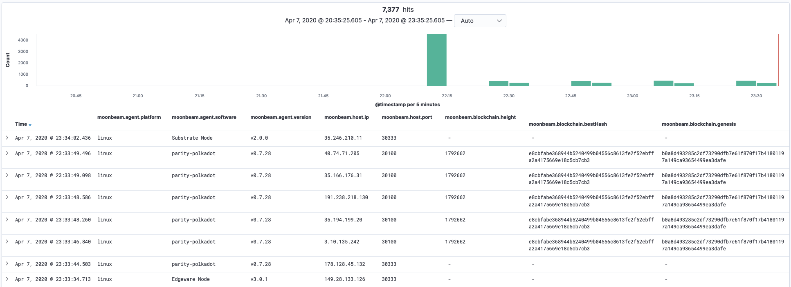
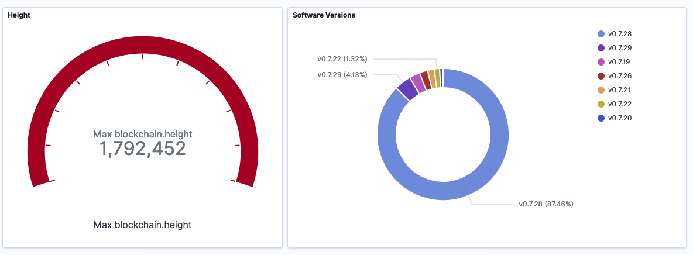

= Moonbeam - Polkadot Network Crawler
:imagesdir: .
ifdef::env-github[]
:imagesdir: https://raw.githubusercontent.com/emeraldpay/moonbeam/master
endif::[]

image:https://github.com/emeraldpay/moonbeam/workflows/Tests/badge.svg["Unit Tests"]
image:https://img.shields.io/docker/pulls/emeraldpay/moonbeam?style=flat-square["Docker",link="https://hub.docker.com/r/emeraldpay/moonbeam"]
image:https://img.shields.io/github/license/emeraldpay/moonbeam.svg?style=flat-square&maxAge=2592000["License",link="https://github.com/emeraldpay/moonbeam/blob/master/LICENSE"]
image:https://badges.gitter.im/emeraldpay/community.svg[link="https://gitter.im/emeraldpay/community?utm_source=badge&utm_medium=badge&utm_campaign=pr-badge]

Emerald Moonbeam is a crawler to gather the network information of the Polkadot nodes. The crawler connects to each available node, gets the
details about the node (software version, etc) and its peers to continue crawling.

The current implementation is targeting the Kusama network (i.e. uses its bootnodes, follows compatible nodes, executes
specific commands, etc), but later it may be adapted for other Polkadot/Substrate based blockchains.

NOTE: The project is in an _early stage_ of development. Configuration, run arguments and output format may be changed
      without backward compatibility.

.Features:
- Works on the protocol (libp2p/substrate/polkadot) level, emulates behaviour of a node
- Starting from a bootstrap list, it discovers new nodes and connects to each
- Extracts each node details, such as used software, supported protocols and current blockchain
- Exports gathered details as
** a local log file in JSON format
** MySQL table
** AWS S3
** GCP Storage
- Provides Prometheus compatible monitoring

== Run Instructions

By default it saves details about found nodes into a file in `./log` directory, and logs progress, as amount of
fully processed peers to the console.

=== Using Docker

----
docker run -v $(pwd)/results:/results emeraldpay/moonbeam
----

=== As application

Download a zip with the latest application from https://github.com/emeraldpay/moonbeam/releases (ex. `moonbeam-0.3.0.zip`) and unpack it.

.Download and unpack
----
wget https://github.com/emeraldpay/moonbeam/releases/download/v0.3.0/moonbeam-0.3.0.zip
unzip moonbeam-0.3.0.zip
cd moonbeam-0.3.0
----

.Run
----
./bin/moonbeam
----

=== From sources

.Run (and build) with command:
----
./gradlew run
----

=== Demo Setup

For a detailed demo please see example in the link:demo/[`demo` directory]. This demo setup of Moonbeam shows basic
integration with Grafana for monitoring of the process, and with Kibana to analyzer results of the crawler.

See the demo: link:./demo[./demo]

=== Run Options

NOTE: If you run with Gradle you should pass the arguments with `--args`. Ex.: `--args="--export.file.targetdir=my_results_dir"`

- `--key=<...>` - private key of the node if available. Otherwise a random Private/Public Key are generated and published
to the output, which can be used on the next run to keep the same `PeerId` and improve discovery by other peers.
- `--port=30100` - port to listen for incoming connections. `30100` by default
- `--export.file.targetdir=./log` - directory to save results, `./log` by default. See <<export-json>>
- `--export.mysql.enabled=true` to enable export to MySQL. See <<export-mysql>>
- `--export.s3.enabled=true` to enable export to AWS S3. See <<export-s3>>
- `--export.gs.enabled=true` to enable export to Google Storage. See <<export-gcp-storage>>

== Export data

[#export-json]
=== Export to JSON file

Moonbeam produces a log with all the details about the peers it had connected to. The log is JSON items separated by a
new line.

The log may contain multiple lines, even for the same remote peer. The main reason for that is because the bot periodically
reconnects to peers, to check for availability and updates. Another reason is that the bot is also listening for incoming
connections, so another node can decide to connect to the bot based on its logic.

To specify the directory use `--export.file.targetdir=/path/to/dir`, see other options below.

Example log file: `/val/log/moonbeam.2020-04-08T21-45-21.i5w4gj2r.json.log`, where:

- `moonbeam` standard prefix for all logs
- `2020-04-08T21-45-21` timestamp when file was created, as `yyyy-MM-dd'T'HH-mm-ss`
- `i5w4gj2r` alphanumeric random uniq instance id, to avoid conflicts if many crawlers are running (or when multiple
results are stored in an archive)

.Sample line from the log:
[source, json]
----
{
  "version":"https://schema.emeraldpay.io/moonbeam",
  "timestamp":"2020-03-06T05:07:42.280046Z",
  "peerId":"12D3KooWF5pLe2Vvj41GR3B77mwmp5afAQviMDiLYytbS36VSD2o",
  "agent":{
    "software":"parity-polkadot",
    "version":"v0.7.20",
    "commit":"3738158",
    "platformFull":"x86_64-linux-gnu",
    "platform":"linux",
    "full":"parity-polkadot/v0.7.20-3738158-x86_64-linux-gnu (unknown)"
  },
  "host":{
    "address":"/ip4/18.196.25.132/tcp/30333",
    "hostname":null,
    "ip":"24.156.21.132",
    "port":30333,
    "type":"IP"
  },
  "connection":{
    "connectionType":"OUT",
    "connectedAt":"2020-03-06T05:07:27.276719Z",
    "disconnectedAt":"2020-03-06T05:07:42.279986Z"
  },
  "blockchain":{
    "height":1328525,
    "bestHash":"58e4a0b11edabdbee58c9f5aa430b9b7a7ce344562619b3fb26e2c814d6829aa",
    "genesis":"b0a8d493285c2df73290dfb7e61f870f17b41801197a149ca93654499ea3dafe"
  },
  "protocols":{
    "versions":[
      {"id":"/substrate/ksmcc3","versions":["6","5","4","3"]},
      {"id":"/ipfs/ping","versions":["1.0.0"]},
      {"id":"/ipfs/id","versions":["1.0.0"]},
      {"id":"/ipfs/kad","versions":["1.0.0"]}
    ]
  }
}
----

NOTE: The JSON in the actual log would be JSON one-liners, i.e., __not__ pretty-printed and have `\n` at the end of the line

While most of the fields are self-explanatory, some of them need extra description. Please see below.

.JSON Format
[cols="2a,2a,5"]
|===
| Field | Example Value | Description

| `version`
| `https://schema.emeraldpay.io/moonbeam`
| Version id for this file structure. If the schema of the file changed that breaks compatibility (i.e., fields are
moved or renamed) - it gets a new unique id. Please note that at this stage of the development, the schema is not yet
finalized.

| `timestamp`
| `2020-03-06T05:07:42.280046Z`
| The timestamp when log item was written. Please note it can be different from connection time.

| `connection.connectionType`
| `OUT`
| `IN` or `OUT`, depending on the source of the connection. `IN` means that the remote node initiated connection to the bot.

| `protocols`
|
| List of protocols (in terms of the libp2p) supported by the remote peer

|===

.Run options for JSON export
[cols="3a,2a,5a"]
|===
| Option | Default value | Description

| `--export.file.targetdir`
| `./log`
| Path to store log files

| `--export.file.timelimit`
| `60m`
| Max time period to log into a single file. I.e., by default a new log file will be created every 60 minutes.
If you export to AWS S3/GCP Storage, it's the time after which the file is closed and uploaded. +
Value range: `1m` to `24h`.
|===

[#export-mysql]
=== Export to MySQL

Moonbeam can be configured to export nodes to a MySQL table.

.How it works:

- The bot only appends a new information, and if you need to clean up the table, you have to run an external scheduled job to do so.
- The table is going to have duplicate lines, appended each time the bot hit a peer. Use `SELECT DISTINCT` to get uniq peers.
- Table name: *moonbeam*.

.Table definition SQL
[source, sql]
----
CREATE TABLE `moonbeam` (
  `id` int(11) unsigned NOT NULL AUTO_INCREMENT,
  `found_at` timestamp NOT NULL DEFAULT CURRENT_TIMESTAMP,
  `ip` varchar(45) DEFAULT NULL,
  `peer_id` varchar(200) DEFAULT NULL,
  `agent_full` varchar(128) DEFAULT NULL,
  `agent_app` varchar(64) DEFAULT NULL,
  `agent_version` varchar(64) DEFAULT NULL,
  `genesis` char(66) DEFAULT NULL,
  PRIMARY KEY (`id`)
) ENGINE=InnoDB AUTO_INCREMENT=197 DEFAULT CHARSET=utf8;
----

.MySQL Table Structure
[cols="1a,3a,5"]
|===
| Column | Example | Description

| `found_at` | `2020-03-27 00:05:58` | Timestamp when the peer was found
| `ip` | `34.4.25.101` | IP address
| `peer_id` |  | PeerId
| `agent_full` | `parity-polkadot/v0.7.28-7f59f2c-x86\_64-linux-gnu (unknown)` | Full agent name
| `agent_app` | `parity-polkadot` | Type of software
| `agent_version` | `v0.7.28` | Software version
| `genesis` | `b0a8d493285c2df73290dfb7e61f870f` `17b41801197a149ca93654499ea3dafe` | Hash of the genesis block

|===

.Run options
[cols="3a,2a,5a"]
|===
| Option | Default value | Description

| `--export.mysql.enabled`
| `false`
| Enable/disable export to MySQL

| `--export.mysql.url`
| `localhost:3306/moonbeam`
| URL to connect. Format `${HOST}:${PORT}/${DATABASE}`

| `--export.mysql.username`
| `moonbeam`
| Username

| `--export.mysql.password`
|
| Password
|===

.Example:
----
docker run -v $(pwd)/results:/results emeraldpay/moonbeam \
   --export.mysql.enabled=true \
   --export.mysql.url=10.0.2.100:3306/moonbeam \
   --export.mysql.password=123456
----

[#export-s3]
=== Export to AWS S3

Setup Moonbeam to upload logs to the Amazon AWS S3 bucket. Please note that the files are uploaded once they are
finished (i.e. closed) by JSON exporter. By default it's every 60 minutes. See <<export-json>>

.Run options
[cols="3a,2a,5a"]
|===
| Option | Default value | Description

| `--export.s3.enabled`
| `false`
| Enable/disable export to AWS S3

| `--export.s3.region`
| `us-east-1`
| (required) AWS Region

| `--export.s3.bucket`
|
| (required) S3 Bucket to upload files

| `--export.s3.path`
|
| (optional) Path prefix, i.e. a directory. Example: `--export.s3.path=moonbeam/` (note trailing slash)

| `--export.s3.accesskey` +
`--export.s3.secretkey`
|
| (required) AWS credentials
|===

.Example:
----
docker run -v $(pwd)/results:/results emeraldpay/moonbeam \
  --export.s3.enabled=true \
  --export.s3.accesskey=AKIJF5KA05L1JAF \
  --export.s3.secretkey=i85aGTgtzh39t9+h8gka9bkbAEW1lgIYVC811Aoe \
  --export.s3.bucket=my-crawler-bucket \
  --export.s3.region=us-east-1 \
  --export.s3.path=moonbeam/
----

[#export-gcp-storage]
=== Export to GCP Storage

Setup Moonbeam to upload logs to the Google Cloud Storage bucket. Please note that the files are uploaded once they are
finished (i.e. closed) by JSON exporter. By default it's every 60 minutes. See <<export-json>>

.Run options
[cols="3a,2a,5a"]
|===
| Option | Default value | Description

| `--export.gs.enabled`
| `false`
| Enable/disable export to GCP Storage

| `--export.gs.bucket`
|
| (required) GCP Bucket name to upload files

| `--export.gs.path`
|
| (optional) Path prefix, i.e. a directory. Example: `--export.gs.path=moonbeam/` (note trailing slash)

| `--export.gs.credentials`
|
| (optional) Path to JSON file with credentials
|===

.Example:
----
docker run -v $(pwd)/results:/results -v $(pwd)/gcloud.json:/etc/moonbeam/gcloud.json emeraldpay/moonbeam \
  --export.gs.enabled=true \
  --export.gs.credentials=/etc/moonbeam/gcloud.json \
  --export.gs.bucket=my-crawler-bucket \
  --export.gs.path=moonbeam/
----

== Monitoring

=== Service monitoring with Prometheus

Application exports Prometheus compatible status at http://127.0.0.1:1234

.Run options
[cols="3a,2a,5a"]
|===
| Option | Default value | Description

| `--prometheus.host`
| `127.0.0.1`
| Host to bind Prometheus exporter

| `--prometheus.port`
| `1234`
| Port to bind Prometheus exporter
|===

.Exported metrics
[cols="2a,2a,2a,5a"]
|===
| Name | Labels | Type | Description

| `moonbeam_transfer_bytes_total`
| `dir_conn` + `dir_trans`
| Counter
| Total Bytes transferred by the crawler.

| `moonbeam_msgs_total`
| `dir_conn` + `dir_trans`
| Counter
| Total messages transferred

| `moonbeam_connection_errors_total`
| `conn_err_type`
| Counter
| Connection errors, i.e. timeout, host inaccessible, etc

| `moonbeam_protocol_errors_total`
| `dir` + `proto_level`
| Counter
| Error specific for the libp2p or Polkadot protocol

| `moonbeam_discover_total`
|
| Counter
| Discovered addresses

| `moonbeam_connect_total`
| `dir`
| Counter
| Connections to peers

| `moonbeam_connect_ok_total`
| `dir`
| Counter
| Successfully finished connections to peers

| `moonbeam_peers_reported_total`
|
| Histogram
| How many neighbour peers were reported by a connection

| `moonbeam_connection_time_seconds`
|
| Summary
| Time spent on a connection. With the following quantiles: 90% (+/- 1%), 95% (+/- 0.5%), 99% (+/- 0.1%)

|===

.Labels
[cols="2a,2a,5a"]
|===
| Label | Options | Description

| `dir`
| `in`, `out`
| Direction of the connection, i.e. `out` when bot connects to another
peer, and `in` when processing an incoming connection.

| `dir_trans`
| `in`, `out`
| Direction of the bytes transferred, i.e. inside a connection.

| `conn_err_type`
| `timeout`, `io`, `internal`
| Type of a connection error

| `proto_level`
| `mplex`, `noise`
| Level on which an error happened.

|===

In addition to the metrics above the application exports JVM metrics (such as memory use, threads, etc),
and process (file descriptors, etc) metrics.
All of those metrics are available under `jvm_` namespace, or under `process_`.

== Configuration File

Instead of passing configuration as command line options, all of them could be specified with a config file and
pass a path to it as `--spring.config.location=PATH_TO_FILE`.

.Example `moonbeam.properties`
[source, properties]
----
## Main Configuration
# Port to listen for connections
port=30100
# Private key to use, otherwise a new random key generated
key=

## Prometheus Monitoring
prometheus.host=127.0.0.1
prometheus.port=1234

## Export ot JSON
# Directory for files
export.file.targetdir=/var/log
# Time limit for a file, after which a new file is created
export.file.timelimit=60m

## Export to MySQL
export.mysql.enabled=false
# Url to the database
export.mysql.url=jdbc:mysql://localhost:3306/moonbeam
# Username
export.mysql.username=moonbeam
# Password
export.mysql.password=

## Export ot AWS S3
export.s3.enabled=false
# AWS region with the bucket
export.s3.region=us-east-1
# Bucket to use
export.s3.bucket=
# Path on the bucket
export.s3.path=
# AWS Auth Key
export.s3.accesskey=
# AWS Auth Key Secret
export.s3.secretkey=

## Export to GCP Storage
export.gs.enabled=false
# Bucket to use
export.gs.bucket=
# Path on the bucket
export.gs.path=
# Path to JSON file with credentials
export.gs.credentials=
----

== Development

=== Design overview

.System requirements:
- Java 11+
- Gradle 5.6+
- (optional) port 30100 accessible from the internet to accept incoming connections

.Frameworks and Libraries
- Kotlin
- Spring Boot + Spring Framework
- Spring Reactor + Netty
- `io.libp2p:jvm-libp2p-minimal` for libp2p types/structures (_provided transport/security are not used, Moonbeam has own implementation_)
- Groovy + Spock Framework for testing

.Design decisions:
- Uses https://projectreactor.io/[Spring Reactor] and https://en.wikipedia.org/wiki/Reactive_Streams[reactive streams] idea
  in general. It allows opening many non-blocking connections with minimal overhead, avoiding threads and state
  synchronization, which is especially crucial for a crawler to make sure it can process hundreds of peers and thousands
  of connections in parallel.
- Because the libp2p library for JVM was not production ready at the moment of the development, the required subset of
  the Libp2p protocol was implemented from scratch. Moonbeam implementation has only part of the protocol that is specific
  for bot functionality and may be missing many other features.
- A similar situation is for SCALE codec, which didn't have any implementation for JVM. Therefore Moonbeam has its own
  small unoptimized implementation, which is suitable only for reading some types of messages that bot is accessing.
- The bot is designed for aggressive use of the protocol, just to gather all important details from remotes. It doesn't
  follow some of the Libp2p and Substrate protocols guidelines, it uses many shortcuts and sometimes deliberately ignores
  or misuses parts of the protocols to get job done.

=== Build Instructions

To build the source code please install Gradle from the website https://gradle.org/, or through SDKMAN https://sdkman.io/

.Local build
----
gradle build
----

.To build local Docker image:
----
gradle jibDockerBuild

...

docker run emeraldpay/moonbeam
----

== Commercial Support

Want to support the project, prioritize a specific feature, or get commercial help with using Moonbeam in your project?
Please contact splix@emeraldpay.io to discuss the possibility

== License

The core project code is released under Apache 2.0 license.

Demo and docs are published under CC0 license + additionally Apache 2.0 for code parts in the examples/demo.

File `src/proto/dht.proto`, with the definition of DHT Protobuf messages, is taken from libp2p specification and has
the same license as it specified for the libp2p specification.